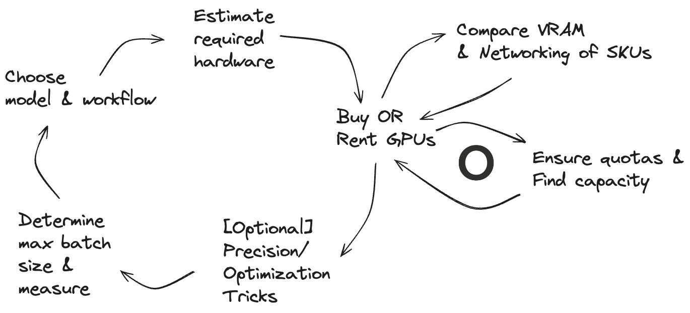

## Concepts and methods

### Gathering data

### Continued pretraining
**Continued pretraining**: Adapt language models to a new language or domain, or simply improve it by continue pre-training (causal language modeling) on a new/specific dataset.

### Finetuning

**Supervised fine-tuning**: teach language models to follow instructions and tips on how to collect and curate your own training dataset.

`litgpt finetune_full`: This method trains all model weight parameters and is the most memory-intensive fine-tuning technique in LitGPT.

### Alignment

**Reward modeling**: Teach language models to distinguish model responses according to human or AI preferences.

**Rejection sampling**: A technique to boost the performance of a SFT model.

**Direct preference optimization (DPO)**: a powerful and promising alternative to PPO.

**Odds Ratio Preference Optimisation (ORPO)**: a technique to fine-tune language models with human preferences, combining SFT and DPO in a single stage.es

### Paremeter-efficient finetuning (PEFT) methods
`litgpt finetune_lora`: A more memory-efficient alternative to full fine-tuning.

- `litgpt finetune_lora stabilityai/stablelm-base-alpha-3b`

`litgpt finetune_adapter`: A form of prefix-tuning that prepends a learnable adaption-prompt to the inputs of the attention blocks in an LLM.

`litgpt finetune_adapter_v2`


### Questions
- What is relation between fine-tuning and alignment?

- How to use Nvidia NIM to connect LLM to   
    - combinatorial search
    - logic
    - CSP
    - difference between inductive vs. deductive reasoning
    - soundness vs. completeness of inference/reasoning

## Patterns

### Use a torchtune recipe

### Finetune with LitGPT

### Finetune with Axoltl

## Metaflow templates in this repo 

composer? 

| Model | Pretrained by | Use case | Workflow Type | Launcher | Trainer library | Hardware | Notes |
| ---: | :--- | ---: | :--- | --- | --- | --- | --- |
| llama-8b | Meta | text generation, chat | fine-tuning | torchtune | torch | ... | ... | 
| llama-8b | Meta | text generation, chat | fine-tuning | deepspeed | torch | ... | ... |
| llama-8b | Meta | text generation, chat | fine-tuning-lora | torchtune | torch | ... | ... |
| mistral-8b | Mistral | text generation, chat | fine-tuning | torchtune | torch | ... | ... |
| mistral-8b | Mistral | text generation, chat | fine-tuning | deepspeed | torch | ... | ... |
| mistral-8b | Mistral | text generation, chat | fine-tuning-lora | torchtune | torch | ... | ... |
| ... | ... | ... | ... | ... | ... | ... | ... |
| llama-70b | Meta | text generation, chat | fine-tuning | torchtune | ... | ... | ... |
| llama-70b | Meta | text generation, chat | fine-tuning | deepspeed | ... | ... | ... |
| llama-70b | Meta | text generation, chat | fine-tuning-lora | torchtune | ... | ... | ... |
| mixtral-8x7b | Mistral | text generation, chat | fine-tuning | torchtune | ... | ... | ... |
| mixtral-8x7b | Mistral | text generation, chat | fine-tuning | deepspeed | ... | ... | ... |
| mixtral-8x7b | Mistral | text generation, chat | fine-tuning-lora | torchtune | ... | ... | ... |
| codestral | Mistral | text generation, chat | fine-tuning | torchtune | ... | ... | ... |
| stable-diffusion-xl | Stability AI | text-to-image, text-to-video | fine-tuning | ... | ... | ... | ... |
| stable-diffusion-xl | Stability AI | text-to-image, text-to-video | fine-tuning | ... | ... | ... | ... |
| stable-diffusion-xl | Stability AI | text-to-image, text-to-video | fine-tuning-lora | ... | ... | ... | ... |

## Choosing a hardware setup

A critical developer experience bottleneck in AI is the cycle of choosing what you want to do, what resources doing this requires, how to find and use these resources. 



Major cloud providers can add a layer of indirection by buying and repackaging GPUs from Nvidia and AMD in EC2 offerings. If Robin knows her workflow tasks require GPU cards with ≥24 GB of RAM, knowing the available GPUs and mapping them to cloud VMs can be difficult. Google has a handy CLI filter and matching UI table filter to make this easier:
```
gcloud compute accelerator-types list --filter="nvidia-h100-80gb"
```

## Heuristics

- To do a full finetune of a 7B model requires ≥1-4 cards with ≥24 GB VRAM.
    - Using `PagedAdamW` from `bitsandbytes` reduces the number of cards you'll need.
- To do a full finetune of a 70B model requires 8 cards with 80 GB VRAM.
- To do a LORA finetune of a 7B model requires ≥1 cards with ≥24 GB VRAM, possibly ≥1-2 cards with ≥16 GB VRAM.
- To do a QLoRA finetune of a 7B model requires ≥1 card with ≥16 GB VRAM.

## Data center GPUs

| GPU Type | Architecture | Today's equivalent | Dtypes | VRAM | Memory Bandwidth | Interconnect | Server packaging | AWS | Azure | GCP |
| --- | --- | --- | --- | --- | --- | --- | --- | --- | --- | --- |
| [H200 80GB SXM](https://resources.nvidia.com/en-us-gpu-resources/hpc-datasheet-sc23?lx=CPwSfP) | Hopper | N/A | bf16, fp64, fp32, fp16, fp8, int8 | 141GB | 4.8TB/s | NVLink 900GB/s | 4 or 8 GPUs | N/A | ... | ... |
| [H200 80GB NVL](https://resources.nvidia.com/en-us-gpu-resources/hpc-datasheet-sc23?lx=CPwSfP) | Hopper | N/A | bf16, fp64, fp32, fp16, fp8, int8 | 141GB | 4.8TB/s | NVLink 900GB/s | 1-8 GPUs | N/A | | |
| [H100 PCIe](https://resources.nvidia.com/en-us-gpu-resources/h100-datasheet-24306?lx=CPwSfP) | Hopper | N/A | bf16, fp64, fp32, fp16, fp8, int8 | 80GB HBM3 | 3.35TB/s | NVLink 600GB/s | 1-8 GPUs | N/A | ... | ... |
| [H100 SXM](https://resources.nvidia.com/en-us-gpu-resources/h100-datasheet-24306?lx=CPwSfP)| Hopper | N/A | bf16, fp64, fp32, fp16, fp8, int8 | 80GB HBM3 | 2TB/s | NVLink 900GB/s | 4 or 8 GPUs | `p5.48xlarge` | ... | `a3-megagpu-8g` | 
| [H100 NVL](https://resources.nvidia.com/en-us-gpu-resources/h100-datasheet-24306?lx=CPwSfP)| Hopper | N/A | bf16, fp64, fp32, fp16, fp8, int8 | 188 GB | 7.8TB/s | NVLink 600GB/s | 2-4 GPU pairs | N/A | 
| [A100 80GB PCIe](https://www.nvidia.com/content/dam/en-zz/Solutions/Data-Center/a100/pdf/nvidia-a100-datasheet-us-nvidia-1758950-r4-web.pdf) | Ampere | H100 | fp64, fp32, tf32, bf16, fp16, int8 | 80GB HBM2e | 1.935TB/s | NVLink 600GB/s | ... | N/A | `NC_A100_v4-series` | ... |
| [A100 80GB SXM](https://www.nvidia.com/content/dam/en-zz/Solutions/Data-Center/a100/pdf/nvidia-a100-datasheet-us-nvidia-1758950-r4-web.pdf)| Ampere | H100 | fp64, fp32, tf32, bf16, fp16, int8 | 80GB HBM2e | 2.039TB/s | NVLink 600GB/s | ... | `p4de.24xlarge` | | `a2-ultragpu-1g`, ..., `a2-ultragpu-1g` | 
| [A100 40GB PCIe](https://www.nvidia.com/content/dam/en-zz/Solutions/Data-Center/a100/pdf/nvidia-a100-datasheet-us-nvidia-1758950-r4-web.pdf) | Ampere | H100 | fp64, fp32, tf32, bf16, fp16, int8 | 40GB HBM2 | 1.555TB/s | NVLink 600GB/s  | ... | N/A |  ... | ... |
| [A100 40GB SXM](https://www.nvidia.com/content/dam/en-zz/Solutions/Data-Center/a100/pdf/nvidia-a100-datasheet-us-nvidia-1758950-r4-web.pdf) | Ampere | H100 | fp64, fp32, tf32, bf16, fp16, int8| 40GB HBM2 | 1.555TB/s | NVLink 600GB/s  | ... | `p4d.24xlarge` | ... | `a2-highgpu-1g`, ..., `a2-highgpu-16g` | 
| [L40s](https://resources.nvidia.com/en-us-gpu-resources/proviz-partner-l40s?lx=CPwSfP) | Ada Lovelace | N/A | fp32, tf32, bf16, fp16, fp8, int4, int8 | 48GB GDDR6 | 864GB/s | PCIe Gen4x16: 64GB/s | ... | N/A |  ... | ... |
| [L40](https://resources.nvidia.com/en-us-gpu-resources/nvidia-l40-datasheet?lx=CPwSfP) | Ada Lovelace | N/A | fp32, tf32, bf16, fp16, fp8, int4, int8 | 48GB GDDR6 | 864GB/s | PCIe Gen4x16: 64GB/s | ... | N/A |
| [L4](https://resources.nvidia.com/en-us-gpu-resources/l4-tensor-datasheet?lx=CPwSfP) | Ada Lovelace | N/A | fp32, fp16, bf16, tf32, int8 | 24GB GDDR6 | 300GB/s | PCIe Gen4 64GB/s | 1-8 GPUs | `g6.xlarge`, ..., `g6.48xlarge` | N/A | `g2-standard-4	`, ..., `g2-standard-96` |
| [A2](https://resources.nvidia.com/en-us-gpu-resources/a2-gpu-datasheet?lx=CPwSfP) | Ampere | ... | ... | 16GB GDDR6 | 200GB/s | PCIe Gen4 | ... | ... | N/A |
| [A40](https://images.nvidia.com/content/Solutions/data-center/a40/nvidia-a40-datasheet.pdf) | Ampere | L40/L40s | ... | 48GB GDDR6 | 696GB/s | NVLink 112.5GB/s | ... | N/A |
| [A30](https://resources.nvidia.com/en-us-gpu-resources/a30-datasheet?lx=CPwSfP) | Ampere | ... | bf16, fp64, fp32, tf32, fp16, int4, int8 | 24GB HBM2 | 933GB/s | NVLink 200GB/s | ... | N/A |
| [A16](https://images.nvidia.com/content/Solutions/data-center/vgpu-a16-datasheet.pdf) | Ampere | ... | fp32, tf32, fp16, int8 | 4x 16GB GDDR6 | 4x 200GB/s | PCIe Gen4: 64 GB/s | ... | N/A |
| [A10G](https://aws.amazon.com/ec2/instance-types/g5/) | Ampere | ... | ... | 24GB GDDR6 | 600GB/s | PCIe Gen4: 64 GB/s | ... | `g5.xlarge`, ..., `g5.48xlarge` |
| [A10](https://resources.nvidia.com/en-us-gpu-resources/a10-datasheet-nvidia?lx=CPwSfP) | Ampere | ... | bf16, fp32, tf32, fp16, int4, int8 | 24GB GDDR6 | 600GB/s | PCIe Gen4: 64 GB/s | ... | N/A |
| [T4](https://resources.nvidia.com/en-us-gpu-resources/t4-tensor-core-datas?lx=CPwSfP) | Turing | ... | int4, int8 | 16GB GDDR6 | ... | PCIe Gen3: 32GB/s | ... | N/A | ... | `nvidia-tesla-t4` |
| [RTX A6000](https://www.nvidia.com/en-us/design-visualization/rtx-a6000/) | Ampere | L40/L40s | ... | 48GB GDDR6 | 768GB/s | NVLink 112.5GB/s | ... | ... | ... | ... |
| [RTX A5000](https://www.nvidia.com/en-us/design-visualization/rtx-a5000/) | Ampere | L40/L40s | ... | 24GB GDDR6 | 768GB/s | NVLink 112.5GB/s | ... | ... | ... | ... |
| [RTX A4000](https://www.nvidia.com/content/dam/en-zz/Solutions/gtcs21/rtx-a4000/nvidia-rtx-a4000-datasheet.pdf) | Ampere | L40/L40s | ... | 16 GB GDDR6 | 448GB/s | PCIe Gen4 | ... | ... | ... | ... |
| Quadro RTX 8000 | Turing | L40/L40s | ... | 48 GB GDDR6 | ... | NVLink 100GB/s | ... | ... | ... | ... |
| Quadro RTX 6000 | Turing | L40/L40s | ... | 24 GB GDDR6 | ... | NVLink 100GB/s | ... | ... | ... | ... |
| Quadro RTX 5000 | Turing | L40/L40s | ... | 24 GB GDDR6 | ... | NVLink 100GB/s | ... | ... | ... | ... |
| Quadro RTX 4000 | Turing | L40/L40s | ... | 24 GB GDDR6 | ... | NVLink 100GB/s | ... | ... | ... | ... |

### Terms: single node multiple GPU

**NVLink**
- A wire-based communications protocol first produced by Nvidia in 2014.
- Direct GPU-to-GPU interconnect that scales multi-GPU input and output (IO) _within a server/VM_.
    - **Direct GPU-to-GPU interconnect leads to better compute utilization rates and less need for `@resources(memory=...)`**
- "A single NVIDIA Blackwell Tensor Core GPU supports up to 18 NVLink 100 gigabyte-per-second (GB/s) connections for a total bandwidth of 1.8 terabytes per second (TB/s)." - [Nvidia](https://www.nvidia.com/en-us/data-center/nvlink/)

**PCIe**
- Peripheral Component Interconnect Express
- A standard for moving data on a bus at high speeds between graphics cards, SSDs, Ethernet connections, etc. 
- Each device connected to the bus has a dedicated connection to the host, which is faster than shared bus architectures.
- PCIe devices communicate via "interconnects" or "links", point-to-point communication channels between PCIe ports that send/receive requests and interrupts. 
- Example use: The PCIe bus is used to attach **non-volatile memory express (NVMe)**, a specification for how hardware and software can better use parallelism in modern SSDs. This reduces I/O overhead.

**SXM** 
- An Nvidia product that connects GPUs by directly socketing them to the motherboard, instead of using PCIe slots to connect them to the motherboard.
- So far, each DGX system series (Pascal, Volta, Ampere, Hopper, ...), comes with its own SXM socket generation.
- SXM may have NVLink switches, allowing faster GPU-to-GPU communication.

### Terms: multiple node multiple GPU

**NVSwitch**
- Part of [DGX-2](https://www.nvidia.com/en-gb/data-center/dgx-2/)
- Extend NVLink across nodes
- Connect multiple NVLinks to provide all-to-all GPU communication at full NVLink speed within a single rack and between racks
 
**NIC**
- Network interface card - _distributed/multi-node training_
- Examples: Nvidia and Microsoft use Infiniband. AWS and GCP have proprietary NICs, the Elastic Fabric Adapter (EFA) and gVNIC, respectively. 
- End user APIs like MPI rely on guarantees of systems at this level. 
    - The connection is made via [libfabric](https://ofiwg.github.io/libfabric/), a communication API that routes requests from MPI (or other) user-facing programs to [providers](https://ofiwg.github.io/libfabric/main/man/fi_provider.7.html), such as Infiniband Verbs, SHM, or EFA.

**RDMA**
- Transfer data directly from application memory - or GPU VRAM - to the wire, reducing need for host resources and latency in message passing.
- When it comes to Nvidia GPUs, [GPUDirect](https://docs.nvidia.com/cuda/gpudirect-rdma/) and [Infiniband](https://www.infinibandta.org/) are important examples of RDMA.

**Infiniband**
- Mellanox manufactured host bus adapters, network switches, and Infiniband. In 2019 Nvidia acquired Mellanox, an Israeli-American computer networking company and the last independent supplier of Infiniband. 
- Infiniband is a NIC, consisting of the physical link-layer protocol and the Verbs API, an RDMA implementation. 
- **interconnect bottleneck**: when connections between integrated circuits are faster than the computation that runs within them.
- On AWS, the proprietary Infiniband substitute is [Elastic Fabric Adapter (EFA)](https://docs.aws.amazon.com/batch/latest/userguide/efa.html).

**GPUDirect**
- Nvidia doesn't market Infiniband much. Instead they leverage a new tech called GPUDirect, which

**NCCL**
- ...

Here are some resources with heuristics and data that simplify this process:
- _What resources does my use case require?_
    - [GCP accelerator-optimized machine family](https://cloud.google.com/compute/docs/accelerator-optimized-machines)
    - [LLM numbers](https://github.com/ray-project/llm-numbers)
    - [Torchtune data](https://github.com/pytorch/torchtune/tree/main?tab=readme-ov-file#fine-tuning-recipes)
- _Is my cluster behaving reasonably?_
    - [HPC latency numbers](https://gist.github.com/understeer/4d8ea07c18752989f6989deeb769b778)
    - [`distributed-training-checklist`](https://github.com/outerbounds/ob-distributed-training-checklist/tree/main) to test core NCCL operations are functional in your Metaflow deployment.

## Where are the big GPUs?

### GCP
As of June 2024,
- Tokyo, Japan, APAC: `asia-northeast1-b`
- Jurong West, Singapore: `asia-southeast1-b`
- St. Ghislain, Belgium: `europe-west1-b`
- Eemshaven, Netherlands: `europe-west4-b`
- Tel Aviv, Israel: `me-west1-b	`
- Ashburn, Virginia: `us-east-4b`
- Council Bluffs, Iowa: `us-central1-c`
- Columbus, Ohio: `us-east5-a`
- The Dalles, Oregon: `us-west1-a`
- Las Vegas, Nevada: `us-west4-a`

## Resources
- [Azure GPU overview](https://learn.microsoft.com/en-us/azure/virtual-machines/sizes/overview?tabs=breakdownseries%2Cgeneralsizelist%2Ccomputesizelist%2Cmemorysizelist%2Cstoragesizelist%2Cgpusizelist%2Cfpgasizelist%2Chpcsizelist#gpu-accelerated)
- [Azure GPU Migration guide](https://learn.microsoft.com/en-us/azure/virtual-machines/n-series-migration)
- [GCP GPU comparison chart](https://cloud.google.com/compute/docs/gpus#n1-gpus)
- [Alignment handbook](https://github.com/huggingface/alignment-handbook/tree/main?tab=readme-ov-file)
- [Understanding Parameter-Efficient Finetuning of Large Language Models: From Prefix Tuning to LLaMA-Adapters](https://lightning.ai/pages/community/article/understanding-llama-adapters/)
- [`torchtune`](https://github.com/pytorch/torchtune)
- [Modernizing GPU Network Data Transfer with NVIDIA NVSwitch](https://www.amax.com/modernizing-gpu-network-data-transfer-with-nvidia-nvswitch/)
